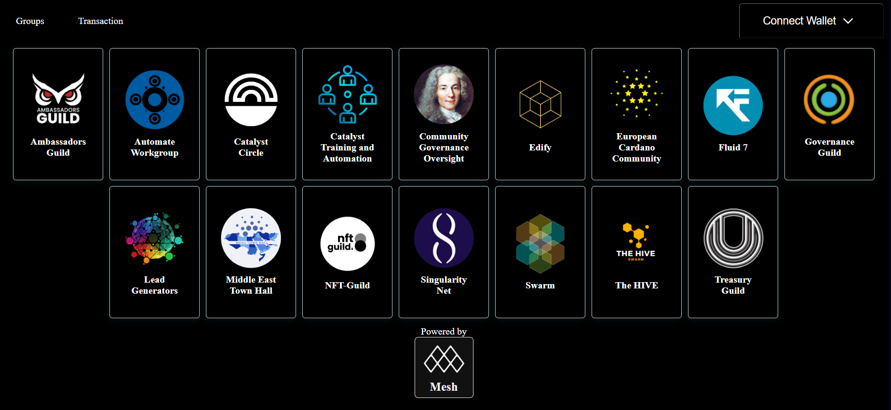

# Automate Workgroup

## What we do

The Automate Workgroup is a collaboration between Treasury Guild and QADAO on governance automation, education and communication.

We have worked on a number of projects together including ..

Fund 6 - Distributed Auditability - [Link](https://cardano.ideascale.com/c/idea/58679)

Fund 6 - Open Source Trainging - [Link](https://cardano.ideascale.com/c/idea/58977)

Fund 8 - Automate, Educate, Communicate - [Link](https://cardano.ideascale.com/c/idea/62054)

Fund 8 - ABC of Governance - [Link](https://cardano.ideascale.com/c/idea/62056)

## Who we are

Treasury Guild and QADAO are a team with many years of experience in accounting, blockchain governance, software development, consultancy, test & project management, social enterprise, investment banking, telecoms, local government, small business operations, financial management and human resources.

### Treasury Guild

Treasury Guild offers a 1 to 1 accounting and treasury service to projects within the Catalyst ecosystem. If you are looking for Treasury Services go [here](https://www.treasuryguild.io/service/). Below you will find our website, Transaction GitBooks and Proposals (need to update proposals page) .

Treasury Guild offers the creation, organization and management of wallets. If you need help opening a wallet, creating the entire payment concept for your team, tools, costs within your project, we will do it for you without any problems. Fast transactions 24/7. We document all transactions in Github and display them in a specially created [Dashboard](https://treasuryguild.com/) for your project. All transactions are stored on the Blockchain. If you want more transaction privacy, we can arrange that too.

<figure><figcaption>
Treasury Guild Dashboard
</figcaption></figure>

Our team created a standard for METADATA. So the history of all transactions is visible on the Blockchain and, most importantly, it cannot be changed, manipulated or faked.

If your project needs a platform like Dework, our team does well on the Dework platform. The transactions we do are not conditioned only by single payments, but we also do bulk payments, up to 100 transactions in one payment.

Some projects inform their team members, the community about their transactions via, for example, Discord. We can create a special channel for you on Discrod where members and the community will receive notifications in real time about all payments and withdrawals that happen in the wallet.

Where does the problem maybe can arise? If you have only one wallet that receives funds for several projects, there could be problems. Our team with special tools and skills can easily track all past incomes and withdrawals and arrange the wallet in such a way that all incomes and withdrawals are clear and easy to understand.







### QADAO

Quality Assurance DAO (QADAO) is an ongoing open source project that provides support for the Cardano Project Catalyst Community.

Quality Assurance DAO (QADAO) began in April 2021 with an Open Source Feedback survey and submitted a proposal “Quality-Assurance-DAO” in the Fund 5: Developer ecosystem Challenge that sought to encourage open-source collaboration & innovation and to do a QA Assessment of Catalyst Proposal Process itself. This proposal was successful in receiving votes and was funded in August 2021. QADAO went on to document the pathway of a funded cohort & began to assess Project Catalyst’s reporting requirements.

We provide the following services :

Documentation and Communication

Auditing and Oversight

Governance and Community Support

Training and Education

Project Management and Automation





## Why Automate, Educate, Communicate

Values - We put transparency first and follow open source principles.

Our approach - We are involved in a lot of projects in Catalyst as well as Singularity Net. Doing work in these projects, we realised the need for certain automations and tools. All automations we have built and used in these projects have also been documented in this GitBook to open up these resources to the community.
