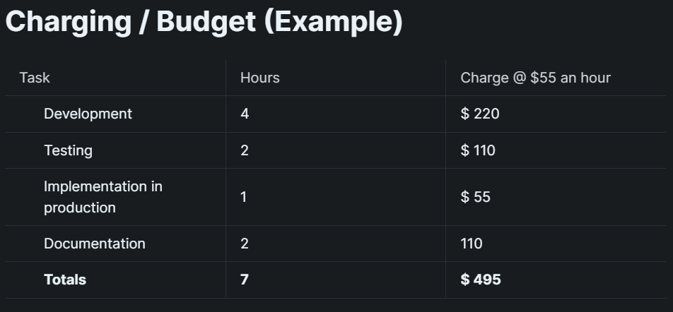

# Introduction to GitHub Actions

### 1. Introduction

We will be covering the bare minimum to get you started. For a more in depth look at how GitHub actions work, have a look [here.](https://docs.github.com/en/actions) We will be using GitHub actions that are available on the [Marketplace.](https://github.com/marketplace?category=\&query=\&type=actions\&verification=) This marketplace will be your go to when you need to automate something.&#x20;

GitHub actions consists of 2 parts. Part 1 is written in JavaScript, we will not be editing this and this works in the background. Part 2 is the part written in Yaml. The Yaml is where we will be doing our editing.&#x20;

GitHub actions gets triggered by specific events. There are more than 90 events that can trigger a GitHub action. It is also possible to let more than one event trigger your GitHub action. For this introduction we will be using [this GitHub action](https://github.com/rjstone/discord-webhook-notify) that sends a Discord message whenever something happens to a GitHub Issue.

### 2.  Creating your GitHub Action Yml file

After you found the action you need on the Marketplace, you need to create the action Yaml file. You can start this by going to the root of your GitHub repo and creating a new file like so.



Next type the following ".github/workflows/discord.yml" You'll notice as you type, every time you type a forward slash the colour of the text and the typefield changes. You can name your action anything you want, but the directory for GitHub actions always needs to be "/.github/workflows/" like so...

.png>)

Next copy the code from this codeblock into the body of your new yaml file.

```
name: Export issues   
on:                   
  issues:
    types: [opened, edited, reopened, closed, deleted, labeled, unlabeled]
 # workflow_dispatch:   
 # schedule:
    # run every 8 hours
  #  - cron:  '0 0,8,16 * * *'
jobs:
  issue:
    runs-on: ubuntu-latest
    name: discord
    steps:
     - name: Test Custom
       uses: rjstone/discord-webhook-notify@v1
       with:
         severity: info
         username: CustomUsername
         color: '#ff00aa'
         avatarUrl: https://github.githubassets.com/images/modules/logos_page/Octocat.png
         description: ${{ github.event.issue.number }}
         details: ${{ github.event.issue.body }}
         footer: This is a footer.
         text: ${{ github.event.issue.title }}
         webhookUrl: ${{ secrets.DISCORD_WEBHOOK }}

 
```

### 3. Yml file breakdown

* Name - Name of the action
* On - List of triggers that trigger the action
* Jobs - Jobs that run when action is triggered. More then one job can run per trigger and jobs can be dependent on other jobs to complete before they run.

#### 3.1 Triggers

For this action we will be using the "issues" trigger. Every time an issue is \[opened, edited, reopened, closed, deleted, labeled, unlabeled] the GitHub action will trigger. In the yml file there are other triggers as well, but they are inactive because of the # symbol. The # symbol turns anything after it on the line into a comment. Feel free to remove the # symbols to experiment with the other triggers. The "schedule" trigger uses [cron](https://crontab.guru/#0\_0\_\*\_\*\_6) to set a specific time for the action to run. To run the action manually you can use "workflow\_dispatch". This is how you run the action manually....


.png>)

.png>)

