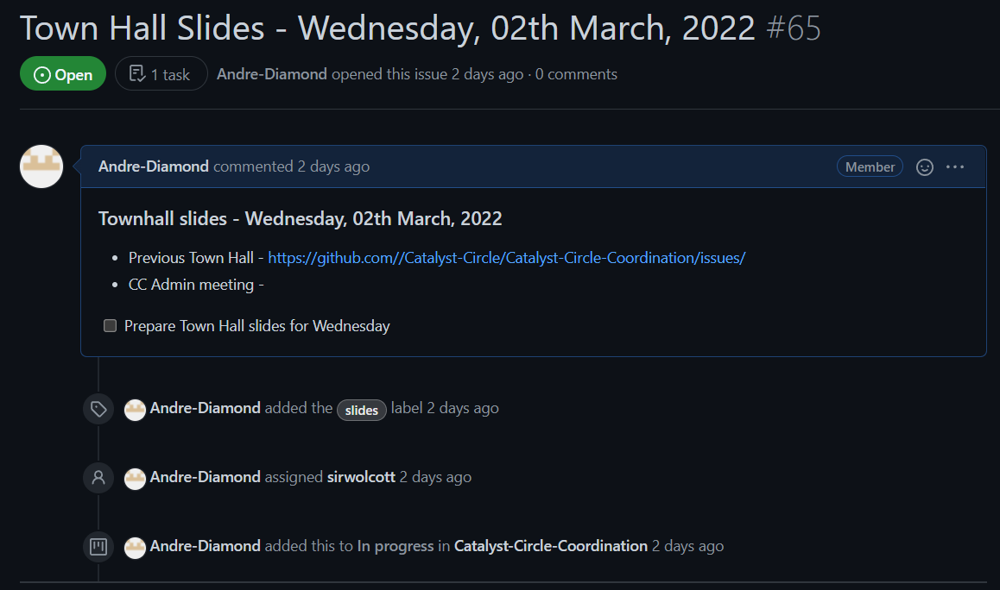

# Town Hall Slides

## GitHub Action

Funded by Distributed Auditability

## Overview



Creating a GitHub action that pulls data from a template issue markdown file, creates an issue with that data and places the issue in the project board and column of your choice.

## Reference Example

[Project board with the Town Hall Issue](https://github.com/Catalyst-Circle/Catalyst-Circle-Coordination/projects/1)

[Automatically open/close issue for town hall slides on every Wednesday](https://github.com/Catalyst-Circle/Catalyst-Circle-Coordination/blob/main/.github/workflows/slides.yml)

## Code

```
#
# Townhall Slides, powered by imjohnbo/issue-bot
# 
name: Townhall slides
on:
  # workflow_dispatch:    # use workflow_dispatch in the actions tab to test your workflows
  schedule:
  # At 00:00 on Wednesday. – https://crontab.guru
  - cron: 0 0 * * 3   # cron sets the time the workflow gets activated

jobs:
  town_hall_slides:
    name: Slides template
    runs-on: ubuntu-latest   
    steps:

    - name: Get template
      uses: imjohnbo/extract-issue-template-fields@v1
      id: extract
      with:   # below is the path to the template issue markdown file
        path: .github/ISSUE_TEMPLATE/town_hall_slides.md # assignees, labels, and title defined in issue template header
      env: 
        GITHUB_TOKEN: ${{ secrets.GITHUB_TOKEN }}

    # Generates and pins new town hall slides issue, closes previous, writes linking comments, adds to project number 1, column name "In progress"
    - name: Todays date
      run: echo "TODAY=$(date -d '7 days' '+ %A, %dth %B, %Y')" >> $GITHUB_ENV  # Create env variable "TODAY" to use later in workflow
    - name: New Slide issue
      uses: imjohnbo/issue-bot@v3
      with:
        token: ${{ secrets.PAT }} # Built in GITHUB_TOKEN permissions are too restrictive, so a personal access token is used here
        assignees: ${{ steps.extract.outputs.assignees }} # Extracts info from issue template markdown file
        labels: ${{ steps.extract.outputs.labels }}
        title: Town Hall Slides - ${{ env.TODAY }}
        body: |
          ### Townhall slides - ${{ env.TODAY }}
          
          * Previous Town Hall - https://github.com//Catalyst-Circle/Catalyst-Circle-Coordination/issues/{{ previousIssueNumber }}
          * CC Admin meeting - 
          
          - [ ] Prepare Town Hall slides for Wednesday
        project: 1  # The project-number from https://github.com/orgs/org/projects/project-number
        column: In progress
        pinned: false
        close-previous: true
        linked-comments: true
```

## Training

Funded by Open Source Training

[https://cardano.ideascale.com/c/idea/368678](https://cardano.ideascale.com/c/idea/368678)

## Charging/Budget

| Task | Hours | Charge |
| ---- | ----- | ------ |
|      |       |        |
|      |       |        |
|      |       |        |

## Sign-off

Where it is in production and who signed it off
