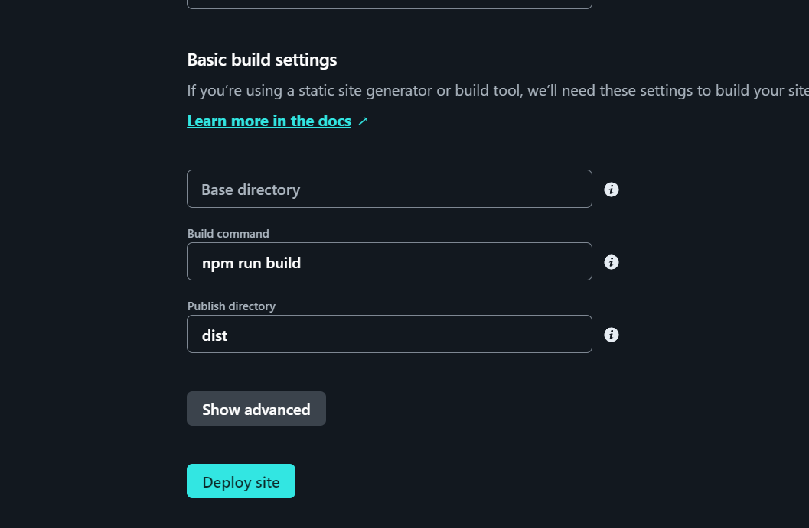

# How to deploy to Netlify


Written by : André Diamond

Funded by - Fund 8 Automate, Educate, Communicate

Licence - [Creative Commons : Attribution 4.0 International (CC BY 4.0)](https://creativecommons.org/licenses/by/4.0/)


## Overview

Follow these steps to deploy your code to Netlify

## Step 1 - Create Netlify account

You can login with GitHub as well. Below is the link to Netlify



## Step 2 - Add new site

On the home page click on "Add new site" and select "Import an existing project"

.png>)

Next click on the GitHub button and follow the Authorization process

.png>)

Next Select the repo you want to add and then click on deploy site

## Step 3 - Adding your .env variables

After you added your site, go to site settings

.png>)

Select "Environment variables" and click on "Add a variable" and select "Add a single variaable"

.png>)

Now enter the key and value as they are saved in the .env file you created in your code and click "Create variable"

.png>)

If you don't know where to find your .env variables or what they are, please have a look here.


[how-to-get-your-discord-auth-token-in-dework-for-.env-file.md](how-to-get-your-discord-auth-token-in-dework-for-.env-file.md)


## Step 4 - Re-deploy site

Select Deploys in the left and click on "Trigger deploy" on the right and select "Clear cache and deploy site"

.png>)

## Final thoughts

Now that your site is deployed, everytime you make changes to your code and commit to GitHub, Netlify will automatically re-deploy your site with the new code.

