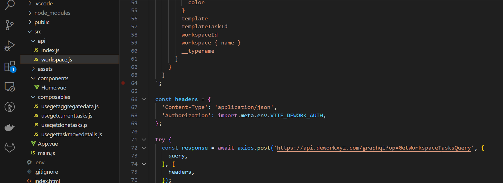

# Dework csv Exporter Automation


Developed by : André Diamond

Funded by - Fund 8 Automate, Educate, Communicate


Live demo



## Overview

The following tool was built with Vue.js . It makes use of Dework's API to get all task information from a specific workspace. This workspace ids can be changed in the code and will be explained in this documentation. The tool looks at all the tasks in review and counts the number of tasks with the audited label and without the audited label. It has a button that links to the bounty board and a button to export the bounty board. This is useful if you want review or pay tasks. Especially if you are managing many bounty boards. The dework spaces used in this documentation can be found here - [https://app.dework.xyz/test-157/main-project-2951](https://app.dework.xyz/test-157/main-project-2951). The tasks on the bounty boards have links to github commits if you want to dive deeper into some of the changes made to prep the code for this documentation.&#x20;


Disclaimer\
This tool exposes your Discord Auth token, so anyone with access to the webpage is able to view your Discord Auth token. Don't share this tool around if you are using it. If you need to share it, you can integrate Discord login into the tool and let the data get accessed via logged in user tokens. To integrate Discord Login you can look into this documentation - [https://supabase.com/docs/guides/auth/social-login/auth-discord](https://supabase.com/docs/guides/auth/social-login/auth-discord)\



## Step 1 - Clone Repo

Clone this repo - [https://github.com/Andre-Diamond/dework-performance-dashboard](https://github.com/Andre-Diamond/dework-performance-dashboard)\
and set up your working environment - If you dont know how to - Follow this guide&#x20;


[how-to-clone-a-github-repo.md](../general-introduction/how-to-clone-a-github-repo.md)


## Step 2 - Find your Workspace ID

To find out what your workspace id is follow these guidelines&#x20;


[how-to-get-dework-workspace-id.md](../general-introduction/how-to-get-dework-workspace-id.md)


## Step 3 - Change Org and Workspace id in code

You can change the organization and workgroup ids in the code in the Home.vue file. Right at the top of the file you will find these variables. \
\
You can change "ACEAMainProject" to anything you want and then the id which looks like this "65345970-fcb3-4962-be04-c1a3276157bd".&#x20;

.png>)

When you change the organiztion id in  -  const orgACE = 'd1ce833b-ab25-4a3b-a0a1-2fbc2077b8cc' only change the id, DO NOT change the "orgACE" as it will lead to bugs if you do not change it everywhere it features.

## Step 4 - Deploy the webpage

Deploy the site using your favourite provider. If you have never deployed a site before follow these guidelines.


[how-to-deploy-to-neltify.md](../general-introduction/how-to-deploy-to-neltify.md)


## Step 5 - Extra things to note

If you want to change the name above the table (currently - Automate, Educate, Communicate (Samples)) go to line 164 in the Home.vue file and change the text between the \<tr> brackets.

I

You can also add more bounty boards, just add more of the following below line 15 in the Home.vue file -&#x20;

```vue
ACEDeworkcsvExport: { id: '3ace81a8-6658-4c41-a480-a16c7f0dc258', name: '', slug: '', tasks: [] },
```

and change the "ACEDeworkcsvExport" and id number.

## Charging

| Task               | Hours | Charge @ $55 an hour |
| ------------------ | ----- | -------------------- |
| Coding             | 6     | 330                  |
| Dework space setup | 1     | 55                   |
| Documentation      | 1     | 55                   |
|                    |       |                      |
| Totals             |       | 440                  |

## Where is this in production

Treasury Guild is using it to assist with weekly payments. Unfortunately we can't share the link yet as the Discord token is still exposed. As soon as its updated to a more sharable version we will share a link here.

