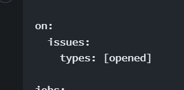
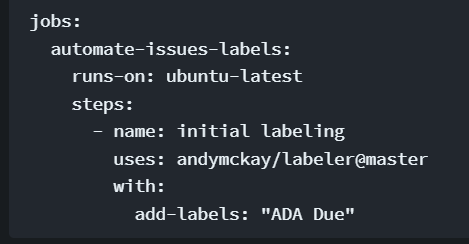

# Add label to newly created issues


Developed by : André Diamond

Funded by - Fund 8 Automate, Educate, Communicate

Licence - [Creative Commons : Attribution 4.0 International (CC BY 4.0)](https://creativecommons.org/licenses/by/4.0/)


## Overview

This is a simple action that adds a label to all newly created issues. For this project we will only add tasks that can be paid to the project board. So we need all new issues to have ADA Due. We will change the "ADA due" to "ADA paid" at a later stage, maybe in another action.

This is a very simple action that runs every time a new issues is created.&#x20;

### 1. Schedule action to run when issue is opened

<figure><figcaption></figcaption></figure>

### 2. Add label to new issue

Provide the label you want to add to the issue. You can add more than one value, just separate them with commas like so - "needs-triage, bug". You can even also remove labels.

```
add-labels: "needs-triage, bug"
remove-labels: "in progress"
```

<figure><figcaption></figcaption></figure>

That is all there is to this action. You can get creative with when this action should run and whether it needs to add or remove labels based on whether the issues are opened or closed.

## Code

```
name: ada-due-label

on:
  issues:
    types: [opened]

jobs:
  automate-issues-labels:
    runs-on: ubuntu-latest
    steps:
      - name: initial labeling
        uses: andymckay/labeler@master
        with:
          add-labels: "ADA Due"
```

## Training

Funded by Automate Communicate Educate

[https://cardano.ideascale.com/c/idea/398131](https://cardano.ideascale.com/c/idea/398131)

## Charging / Budget (Example)

| Task                         | Hours | Charge @ $55 an hour |
| ---------------------------- | ----- | -------------------- |
| Development                  | 0.25  | $ 13.75              |
| Testing                      | 0.25  | $ 13.75              |
| Implementation in production | 0.25  | $ 13.75              |
| Documentation                | 0.25  | $ 13.75              |
| **Totals**                   | **2** | **$ 55**             |

## Sign-Off

Where it is in production and who signed it off




