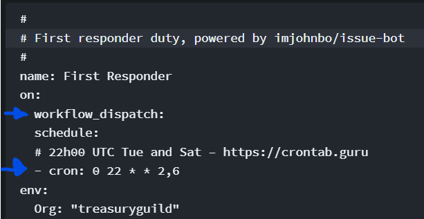
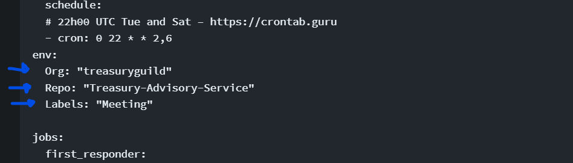
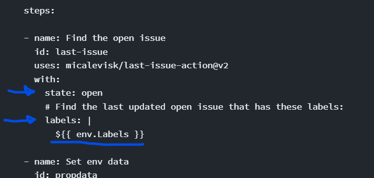
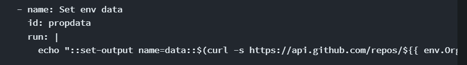
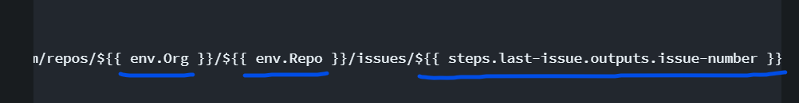
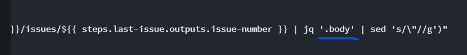
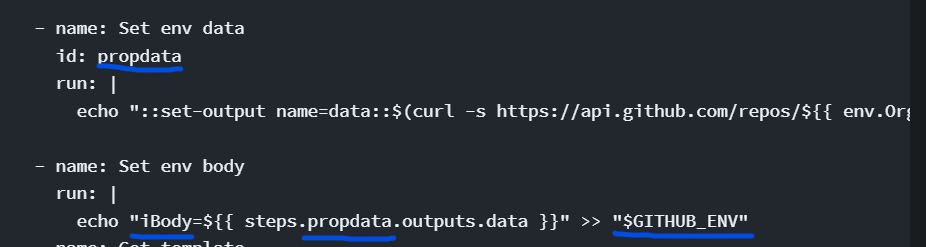
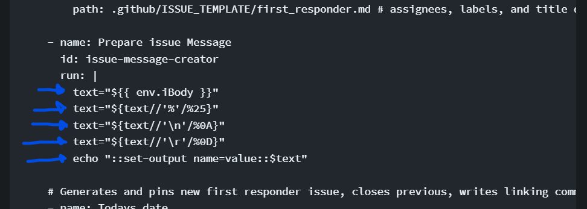
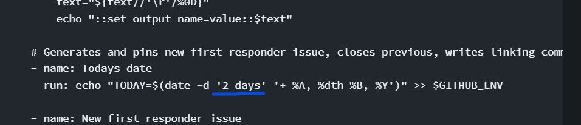
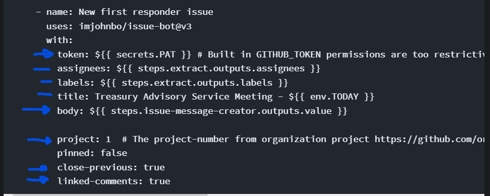

# Meeting Agenda Action

## Overview

This GitHub action looks for an open issue with the label "Meeting". It copies the body of the issue and closes the issue. It then creates a new issue with the same body as the old issue, but with an updated date and title. It uses Cron to have the issues ready for scheduled dates. This is useful for having an issue on your project board that serves as an agenda for meetings. This particular action is built to update the agenda twice a week.&#x20;

It uses the same marketplace GitHub Action found in the Town Hall Slides action, along side another action to find an issue with a certain label. We also do an API call, some text formatting and make use of environment variables in this action.

### 1.  Schedule

We use workflow\_dispatch to manually run our action for testing purposes while building the action. Once we are happy with the results we set the cron value to run our action on specific dates.

<figure><figcaption></figcaption></figure>

### 2. Env Variables

Next up we set the env variables. Enter the names of the org and repo where the project board lives that holds the issue. Enter the label of the issue you want to update. Its best to have a unique label for this one issue to avoid updating other issues.

<figure><figcaption></figcaption></figure>

### 3.  Find the issue

The first step will look for an open issue with the label you provided for the env variable. Take note that you should have only one open issue with this label on the project board. The "state" key refers to the state of the issue (open or closed). And the "labels" key refers to the label of the issue. Note the format we use when referring to env variables - "$\{{ env.Labels \}}" Its basically env. followed by the key we used when setting the variables. (Refer to step above) When this step completes we can get the issue number from it at a later stage by calling the result.

<figure><figcaption></figcaption></figure>

### 4. Doing an API call and setting result to env variable

Next up we get the issue number of the issue found in the step that looked for the open issue with the label. We call this result like so - $\{{ steps.last-issue.outputs.issue-number \}}

We then use this issue number in an API call. This API call looks for an issue in a repo. Note how we use the org and repo env variables in the url as well.&#x20;

<figure><figcaption></figcaption></figure>

<figure><figcaption></figcaption></figure>

<figure><figcaption></figcaption></figure>

The ".body" refers to the key in the returned Json, that you need the value of. If you wanted the title of this issue you would replace .body with .title .We then take the result and turn it into yet another env variable called iBody. Note that this is another way of setting env variables.

<figure><figcaption></figcaption></figure>

Also note how we get values from other steps by using   steps - id - outputs - name.&#x20;

Like so - $\{{ steps.propdata.outputs.data \}}  . The id in this case was propdata and the name was data. You'll see when we do the API call we set the name to data in the beginning of the line right after echo.

### 5.  Get issue template

We get information from the issue template markdown file we created. To see how we create this file, please refer to the Town Hall Slides action as we create a similar template file  there. This template file contains information about the issue we are creating. Like the assignees and labels we want the issue to have when we create it. This step basically just points to the file.

<figure><figcaption></figcaption></figure>

### 6.  Format the text received from the iBody variable

We need to format the text we received from the API call. When we receive this text all the line breaks gets replaced with "\n" which makes it difficult to read and we would rather want this new issue to look exactly the same as the old issue. We give "text" the value of the iBody variable, then we regex it a few times. Each time replacing certain values with other values that will get the format of our text to a state where the final output will match the old issue exactly.

We then set the output, so we can call this value at a later stage.

<figure><figcaption></figcaption></figure>

### 7. Creating date variable

We create a variable that we will use in the title of our new issue to display the date the issue will be used on. In our case it will be the date that the meeting happens on. The "2 days" will add 2 days to the date this issue is created. So make sure that you set your cron value at the beginning of this action to 2 days before the meeting, so that the date is the same as the date of the meeting.

<figure><figcaption></figcaption></figure>

### 8. Creating the new issue and closing the old issue

Finally our last step will make use of a PAT token to create the new issue and close the old one. You can see how to create a [PAT token here](../general-introduction/pat-token.md).  We will use the outputs from the step that extracts data from the template issue to assign the assignees and labels. We will write the title we want and include the date variable env.TODAY .&#x20;

For the body we will use the formatted text by calling the output of the "Prepare Issue message" step like so - $\{{ steps.issue-message-creator.outputs.value \}}&#x20;

We need to provide the number of the project board where these issues live. Then finally we close the issue and link it to the new issue by making the last 2 values equal to true.

<figure><figcaption></figcaption></figure>

## Code

```
#
# First responder duty, powered by imjohnbo/issue-bot
#
name: First Responder
on:
  workflow_dispatch:
  schedule:
  # 22h00 UTC Tue and Sat – https://crontab.guru
  - cron: 0 22 * * 2,6
env: 
  Org: "treasuryguild" 
  Repo: "Treasury-Advisory-Service"
  Labels: "Meeting"
  
jobs:
  first_responder:
    name: New responder duty
    runs-on: ubuntu-latest
    steps:
    
    - name: Find the open issue
      id: last-issue
      uses: micalevisk/last-issue-action@v2
      with:
        state: open
        # Find the last updated open issue that has these labels:
        labels: |
          ${{ env.Labels }}
          
    - name: Set env data
      id: propdata
      run: |
        echo "::set-output name=data::$(curl -s https://api.github.com/repos/${{ env.Org }}/${{ env.Repo }}/issues/${{ steps.last-issue.outputs.issue-number }} | jq '.body' | sed 's/\"//g')"
    
    - name: Set env body
      run: |
        echo "iBody=${{ steps.propdata.outputs.data }}" >> "$GITHUB_ENV"
        
    - name: Get template
      uses: imjohnbo/extract-issue-template-fields@v1
      id: extract
      with:
        path: .github/ISSUE_TEMPLATE/first_responder.md # assignees, labels, and title defined in issue template header
        
    - name: Prepare issue Message
      id: issue-message-creator
      run: |
        text="${{ env.iBody }}"
        text="${text//'%'/%25}"
        text="${text//'\n'/%0A}"
        text="${text//'\r'/%0D}"
        echo "::set-output name=value::$text"
        
    # Generates and pins new first responder issue, closes previous, writes linking comments, assigns to next person in line, adds to organization project number 550, column name "Duties", milestone number 10
    - name: Todays date
      run: echo "TODAY=$(date -d '2 days' '+ %A, %dth %B, %Y')" >> $GITHUB_ENV
      
    - name: New first responder issue
      uses: imjohnbo/issue-bot@v3
      with:
        token: ${{ secrets.PAT }} # Built in GITHUB_TOKEN permissions are too restrictive, so a personal access token is used here
        assignees: ${{ steps.extract.outputs.assignees }}
        labels: ${{ steps.extract.outputs.labels }}
        title: Treasury Advisory Service Meeting - ${{ env.TODAY }}
        body: ${{ steps.issue-message-creator.outputs.value }} 
          
        project: 1  # The project-number from organization project https://github.com/orgs/org/projects/project-number
        pinned: false
        close-previous: true
        linked-comments: true
```

## Training

Funded by Automate Educate Communicate

[https://cardano.ideascale.com/c/idea/398131](https://cardano.ideascale.com/c/idea/398131)

## Charging / Budget (Example)

| Task                         | Hours  | Charge @ $55 an hour |
| ---------------------------- | ------ | -------------------- |
| Development                  | 10     | $ 550                |
| Testing                      | 2      | $ 110                |
| Implementation in production | 1      | $ 55                 |
| Documentation                | 2      | 110                  |
| **Totals**                   | **15** | **$ 825**            |

## Sign-Off

Where it is in production and who signed it off


Project Board with Agenda Issue



Action Yml File



Example of Agenda Issue

